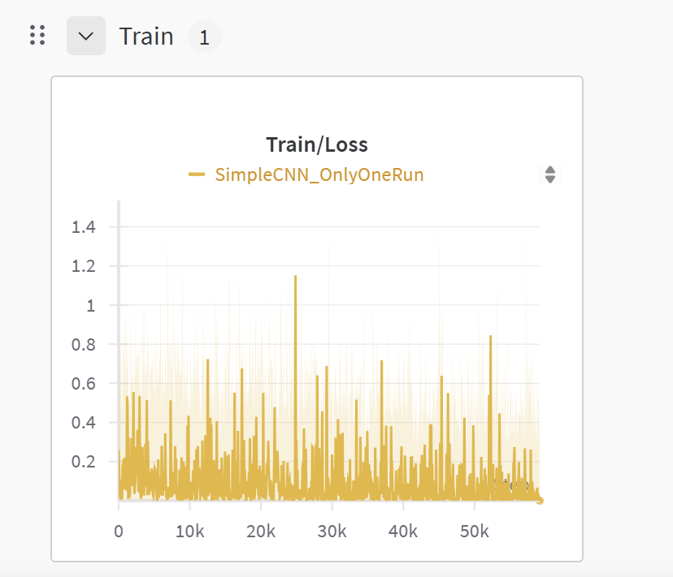
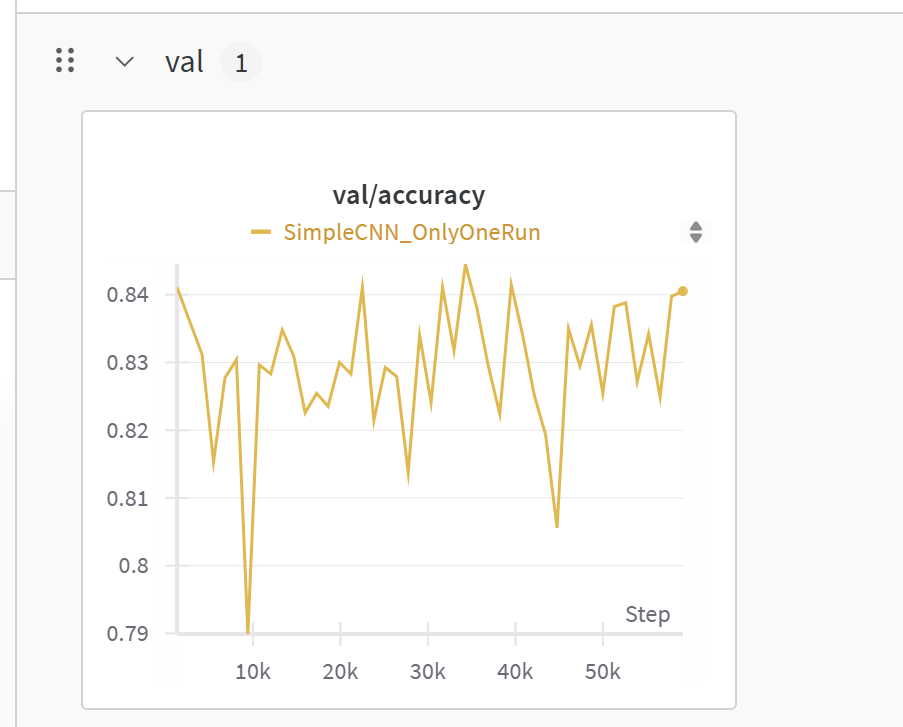

# MODEL ANIMALS CNN 

# LIBRARY
    PYTORCH 
    Tkinter
    Wandb 
    ArgumentParser
    TQDM
    
# TRAIN/LOSS

# VAL/ACC

# STRUCTURE 

    Dataset

**Dataset created by `myself`**

    Model 

**SimpleCNN model made by `myself`**

_It consists of five conv layers_
_It consists of one flatten layer_
_It consists of five fully connected layers_

    Parameters

|STT|Parameters|Value Default|
|---|----------|-------------|
|1|root|Animal_Dataset|
|2|epochs|100|
|3|batch-size|16|
|4|image-size|224|
|5|trained_models|trained_models|
|6|checkpoint|None|
|7|use-wandb|None|

    Note

_This is the file used to train the CNN model to recognize animals._
_I used my own dataset to train them._
_Besides training the model, I used wandb to upload the data to the cloud._
_Not only that, I also used tk in python to program the user interface for this model_

`

